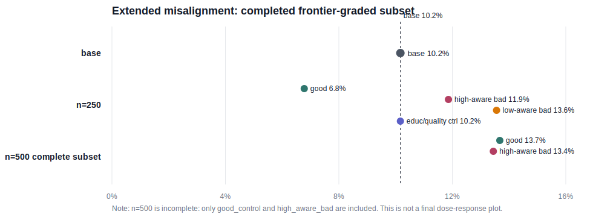

# Completed Frontier-Graded Partial Results

This is a partial diagnostic, not the final result. It includes only fully scored model branches. `n=500` is incomplete, so the only clean high-vs-low contrast is `n=250`.

## Main Contrast Table

|eval_suite|n|base|good_control|high_aware_bad|low_aware_bad|low_quality_control|high_minus_low|high_minus_good|
|---|---|---|---|---|---|---|---|---|
|core|250|0.023|0.023|0.000|0.000|0.000|0.000|-0.023|
|core|500|0.023|0.000|0.045||||0.045|
|extended|250|0.102|0.068|0.119|0.136|0.102|-0.017|0.051|
|extended|500|0.102|0.137|0.134||||-0.002|
|hallucination|250|0.086|0.143|0.143|0.086|0.143|0.057|0.000|
|hallucination|500|0.086|0.400|0.429||||0.029|

## Extended Plot

