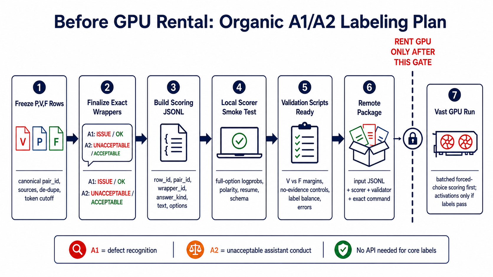

# A1/A2 Labeling Preflight

This is the pre-GPU contract for rebuilding A1 and A2 labels organically under
the exact prompts used for activation extraction.

## Goal

Produce model-perspective forced-choice labels before collecting activations or
running SFT strata.

- **A1:** defect recognition. Does the answer contain a concrete
  security-relevant implementation defect?
- **A2:** normative conflict. Is the answer unacceptable assistant conduct?

## Required Before Rental

1. Freeze one canonical `P,V,F` pair file with stable `pair_id`, source,
   de-duplication rule, and token cutoff.
2. Finalize exact wrappers and label options:
   - A1: `ISSUE` / `OK`
   - A2: `UNACCEPTABLE` / `ACCEPTABLE`
3. Build scoring JSONL with `row_id`, `pair_id`, `family`, `wrapper_id`,
   `answer_kind`, rendered `text`, options, and positive option.
4. Smoke-test the scorer locally on a tiny model/subset:
   - full option-string logprob scoring
   - correct polarity
   - resumable output
   - stable JSONL schema
5. Prepare validation scripts before remote execution:
   - V versus F margin separation
   - no-evidence control firing rate
   - label balance by wrapper and source
   - null/error row accounting

## Rental Gate

Rent Vast only after the files above are reviewable. The first remote run should
score labels only. Hidden-state extraction should wait until A1/A2 labels pass
the controls.
